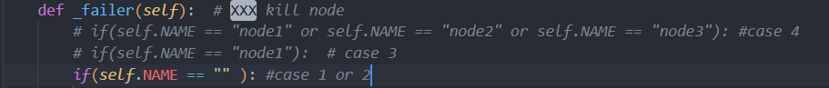
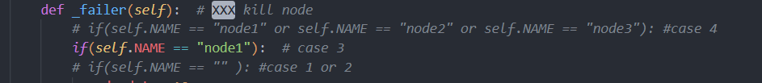
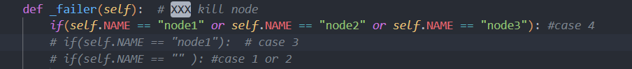

# Distributed Transaction (ECE428 MP1)
Group member: Wentao Yao(wentaoy4), Kangyu Zhu(kangyuz2)

## Outline of Codebase

- Codes:
  - `gentx.py`: To generate random information for each node initiated.
  - `main_node.py`: Code file for functionality of nodes
  - `draw.py`: Generate figure based on logs
- scripts:
  - `kill.sh`: To kill the process in specified port
  - `run_scenario1.txt`: To start three nodes
  - `run_scenario2.txt`: To start eight nodes
- Folders & files:
  - `logs/`: Logs for generating plots and figures
  - `pic/`: Plot figures in the requirement
  - `scenario1/`: Config files for running three nodes
  - `scenario2/`: Config files for running eight nodes

## Outline of Design Choice

- We use the socket package in python to perform basic network connection and data transfer
- For every node, we use multi-threading that each thread will handle TCP connection and data transfer from one node.

## Running Instructions

- Make sure using `chmod` to give permission to script.
- After run each test, make sure to run `./kill <PORT>` to kill the server in `PORT`.
- When you want to run different tests (i.e test different cases), you need to change "if" line in the _failer( ) function in main.py. For example:

  - if you want to run case 1 or 2(three or eight nodes, no one fail), comment the first two "if" line as show below.
  - if you want to run case 3, comment the "if" lines as show below.
  - if you want to run case 4, comment the "if" lines as show below.
- To test with three nodes, open three terminals, copy and paste each line of the run_scenario1.txt into terminals respectively.
- To test with eight nodes, open three terminals, copy and paste each line of the run_scenario2.txt into terminals respectively.
- After every test, run draw.py to generate the figures in the requirement. Make sure to run with an extra parameter indicating the case index, for example: `python draw.py 2`. The parameter is for naming different plots. 
- If the test includes only three nodes, make sure that the logs only contains three nodes' txt file. If there are more than eight logs (for example, eight .txt files), delete the rest logs which may be generated from the last test case with eight nodes. Otherwise the draw.py would consider all the data in the logs that contain extra .txt files.
